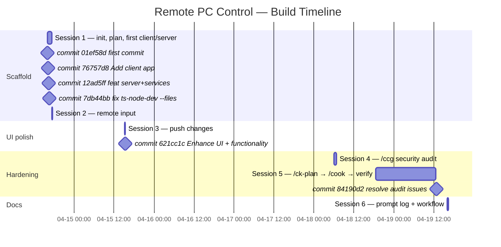
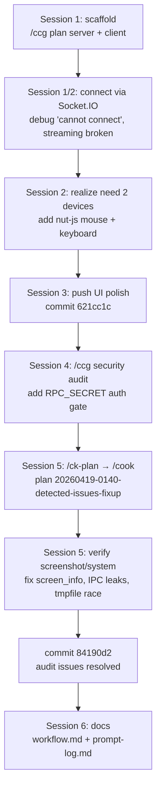

# Prompt Log — Remote PC Control

Chronological log of user prompts since the first commit, reconstructed from Claude Code session transcripts (`~/.claude/projects/C--Users-PC-Desktop-remote-pc-control/*.jsonl`). System-generated task notifications, duplicates, and empty ACKs have been filtered out. Timestamps are UTC.

---

## Session 1 — 2026-04-14 (initial scaffold)
_File: `0bc4f83b-1dd1-4082-9e1a-875e6575b629.jsonl`_

| # | Time (UTC) | Prompt |
|---|------------|--------|
| 1 | 15:58 | set up git for this folder — `git init` / add README / commit / branch -M main / remote add origin → `git@github.com:baohuy98/remote-pc.git` / push -u origin main |
| 2 | 16:00 | yes |
| 3 | 16:03 | push all folder into git |
| 4 | 16:07 | `/oh-my-claudecode:ccg` — *"I am build an remote pc app with typescript, plan to build an server and complete client"* |
| 5 | 16:11 | start |
| 6 | 16:13 | just a project case study in my university |
| 7 | 16:14 | yes |
| 8 | 16:19 | follow your recommeded |
| 9 | 17:05 | run to check |
| 10 | 17:06 | can not connect to server — "Trạng thái: ❌ Mất kết nối" |
| 11 | 17:09 | we can not show UI and mouse? |
| 12 | 17:12 | at this time, when click take a screenshot or start livestream can not see screen of device is remoted |
| 13 | 17:16 | run again |

## Session 2 — 2026-04-14 (remote input + 2-device testing)
_File: `da87269a-07dc-4cbf-a240-f78d72f5aa90.jsonl`_

| # | Time (UTC) | Prompt |
|---|------------|--------|
| 14 | 17:17 | start remote UI |
| 15 | 17:19 | at this time, can not click start livestream or take a screen shot to see client view |
| 16 | 17:21 | it not work |
| 17 | 17:23 | how can server can control client through mouse and keyboard |
| 18 | 17:26 | at this time, when I click on tab from client view, mouse is focus on tab, do I need run server and client in 2 different device |

## Session 3 — 2026-04-15 (push work)
_File: `da87269a-07dc-4cbf-a240-f78d72f5aa90.jsonl`_

| # | Time (UTC) | Prompt |
|---|------------|--------|
| 19 | 15:10 | push new change into git |
| 20 | 15:16 | `/login` |

## Session 4 — 2026-04-18 (security hardening)
_File: `c45598fe-6f8c-4309-a4a6-f7ad188dc8c6.jsonl`_

| # | Time (UTC) | Prompt |
|---|------------|--------|
| 21 | 06:06 | `/oh-my-claudecode:ccg` — *"check code base and add security when start connection"* |
| 22 | 06:07 | `/login` |
| 23 | 06:07 | (re-run) `/oh-my-claudecode:ccg` — check code base and add security when start connection |
| 24 | 06:21 | start to check |
| 25 | 06:25 | at this time, can not take a screen shot or live stream video client screen |
| 26 | 06:28 | you can check log on background task for client — `[1] Server response: screenshot false / lock false / restart false ...` |
| 27 | 06:29 | yes |
| 28 | 06:39 | at this time can not trigger action from client, can not take screen shot or do anything |
| 29 | 06:40 | it still error, just can action only with process tab, the screen and system tab not work |
| 30 | 06:43 | still get issue |
| 31 | 18:22 | hi |

## Session 5 — 2026-04-18/19 (plan → fix → verify)
_Files: `20597730-...`, `eebbba80-...`, `b2835e56-...`_

| # | Time (UTC) | Prompt |
|---|------------|--------|
| 32 | 18:35 | `/ck-plan` — *"check codebase then run and detect issue"* |
| 33 | 18:47 | `/cook` — *"implement plan 20260419-0140-detected-issues-fixup"* |
| 34 | 10:52 (04-19) | `/cook` — *"check status of current plan and implement if not complete yet"* |
| 35 | 10:54 | `/ck-plan` — *"start app then detect issue action if any then fix or confirm this project run well"* |
| 36 | 11:22 | start app for me to test directly |
| 37 | 12:52 | push to git |

## Session 6 — 2026-04-19 (current — docs)
_File: `050f8768-e007-4fca-8743-40c586b050c5.jsonl`_

| # | Time (UTC) | Prompt |
|---|------------|--------|
| 38 | 16:04 | base on these seesion, give me prompt log and workflow of this app |
| 39 | 16:06 | give me prompt log and workflow with mermaid |
| 40 | 16:06 | give me prompt log in md file and workflow with mermaid |
| 41 | 16:14 | can you log all prompt from the first when I start build this appp |

---

## Timeline (commits ↔ prompts)

## High-level build workflow

## Prompt themes

- **Scaffolding** — `ccg` to plan, iterative `yes` / `run again` loops.
- **Debugging streaming** — recurring *"cannot take screenshot / livestream"* across 3 sessions; rooted in IPC + tmpfile + screen-info issues.
- **Remote control realization** — prompt #17 *"how can server can control client through mouse and keyboard"* → prompt #18 *"do I need run server and client in 2 different device"* triggered the nut-js integration.
- **Security pass** — prompt #21 drove the `RPC_SECRET` handshake and default-password warning.
- **Plan → cook → verify loop** — Sessions 4–5 follow the canonical OMC flow (`/ck-plan` → `/cook`) with explicit *"check status of current plan and implement if not complete yet"* re-entry.

---

_Generated from 7 session transcripts across 6 commits on `main` (01ef58d..84190d2)._
