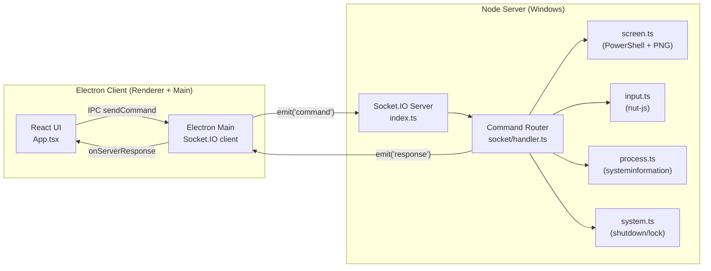
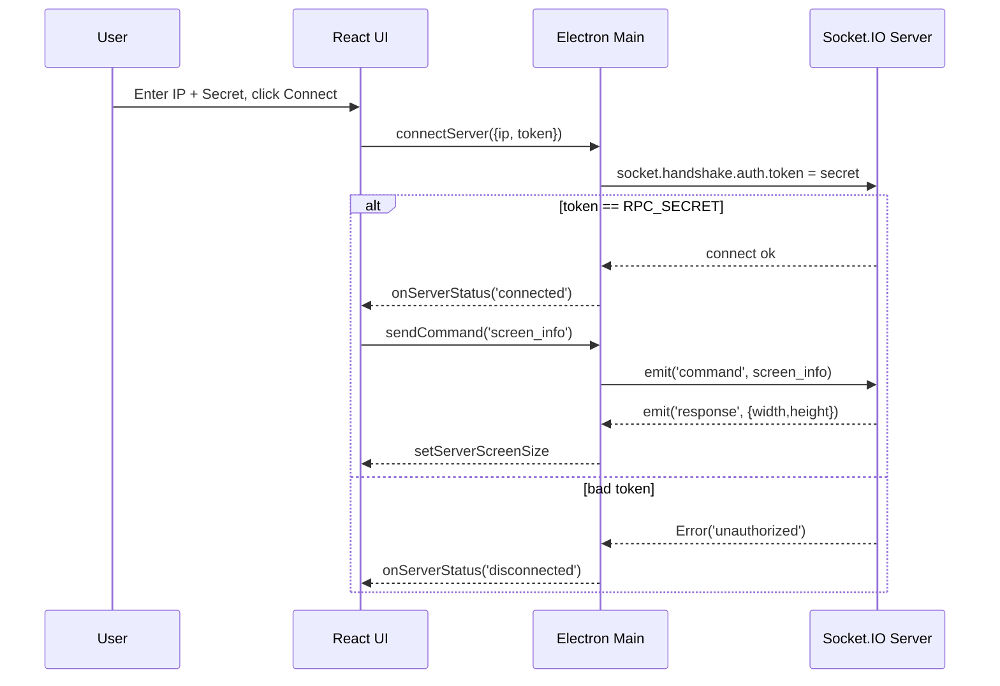
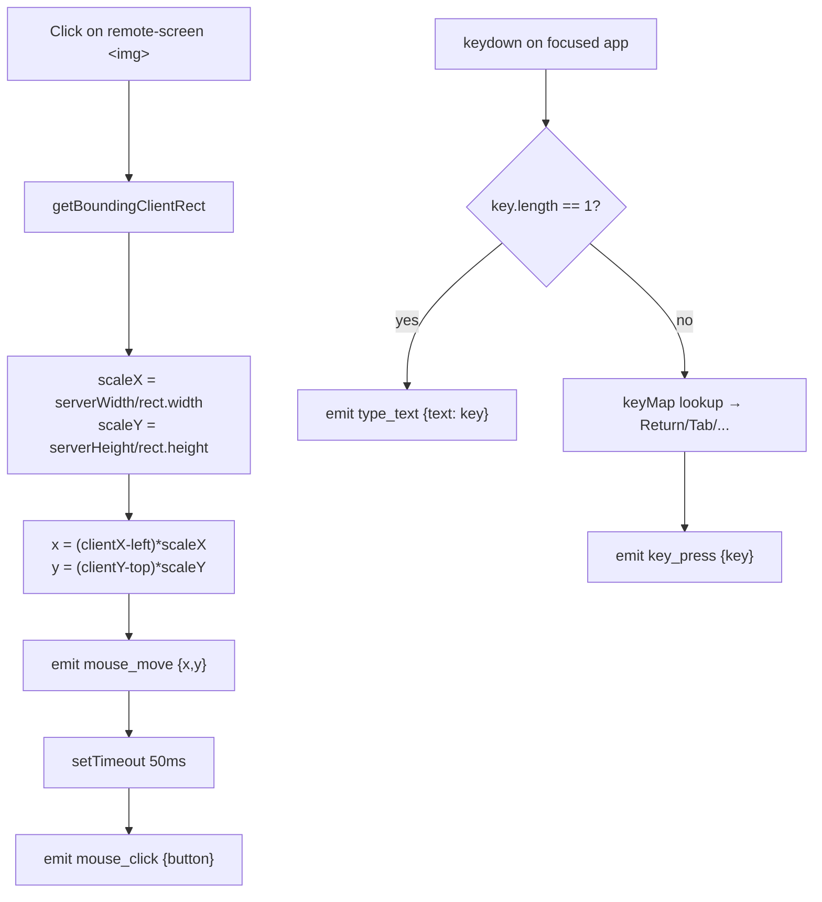
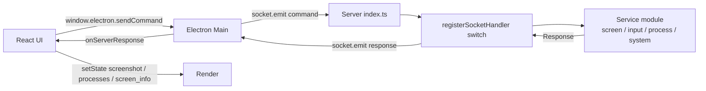

# Remote PC Control — Prompt Log & Workflow

## 1. Architecture Overview

- **Client**: Electron + React (Vite) — `client/`
- **Transport**: Socket.IO with shared-secret handshake auth
- **Server**: Node + TypeScript on Windows — `server/`
- **Native ops**: `@nut-tree-fork/nut-js` (input), PowerShell (screenshot), `systeminformation` (processes/graphics), Windows `shutdown.exe` / `rundll32`



---

## 2. Prompt Log (Command Protocol)

All client→server messages are `socket.emit('command', { action, params })`.
Server replies with `socket.emit('response', { action, data, success, error? })`.

| # | Action | Params | Reply `data` | Handler |
|---|--------|--------|--------------|---------|
| 1 | `screenshot` | — | base64 PNG string | `services/screen.ts` |
| 2 | `screen_info` | — | `{ width, height }` | `services/system.ts:getScreenInfo` |
| 3 | `mouse_move` | `{ x, y }` | `{ x, y }` | `services/input.ts:moveMouse` |
| 4 | `mouse_click` | `{ button: 'left'\|'right' }` | `{ button }` | `services/input.ts:clickMouse` |
| 5 | `key_press` | `{ key }` | `{ key }` | `services/input.ts:pressKey` |
| 6 | `type_text` | `{ text }` | `{ text }` | `services/input.ts:typeText` |
| 7 | `list_processes` | — | top-50 `[{pid,name,cpu,mem}]` | `services/process.ts:listProcesses` |
| 8 | `kill_process` | `{ pid }` | `{ pid }` | `services/process.ts:killProcess` |
| 9 | `shutdown` | — | `{ message }` (5s delay) | `services/system.ts:shutdownPC` |
| 10 | `restart` | — | `{ message }` (5s delay) | `services/system.ts:restartPC` |
| 11 | `lock` | — | `{ message }` | `services/system.ts:lockPC` |
| 12 | `cancel_shutdown` | — | `{ message }` | `services/system.ts:cancelShutdown` |

Unknown actions fall through to: `{ success: false, error: 'Unknown action: <x>' }`.
Any thrown error becomes: `{ success: false, error: err.message }`.

---

## 3. Connection Lifecycle



---

## 4. Live Screen Streaming

```mermaid
sequenceDiagram
  participant R as React UI
  participant M as Electron Main
  participant S as Server
  participant PS as PowerShell

  loop every 500ms while isStreaming
    R->>M: sendCommand('screenshot')
    M->>S: emit('command', screenshot)
    S->>PS: spawn powershell -File screenshot_<uuid>.ps1
    PS-->>S: writes screenshot_<uuid>.png
    S->>S: read file -> base64
    S->>S: finally unlink tmp files
    S-->>M: emit('response', base64)
    M-->>R: setScreenshot(data:image/png;base64,...)
  end
```

---

## 5. Mouse / Keyboard Pipeline



---

## 6. End-to-End Command Flow (generic)



---

## 7. Security Notes

- Server refuses to boot unless `RPC_SECRET` env is set (`server/src/index.ts:6-10`).
- Socket.IO middleware rejects any connection whose `handshake.auth.token` does not equal `RPC_SECRET`.
- Screenshot path uses per-invocation `randomUUID()` tmp files with `finally` cleanup to avoid TOCTOU / leftover files.
- No rate-limit or per-action authorization — anyone holding the secret has full input, process-kill, and shutdown rights.
- CORS is `*` on the HTTP layer; only the socket path is gated.
